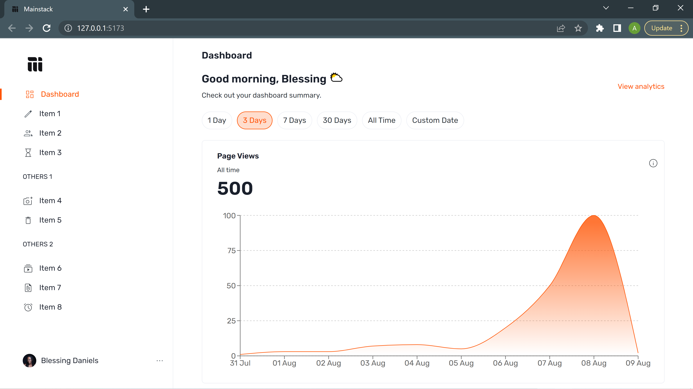
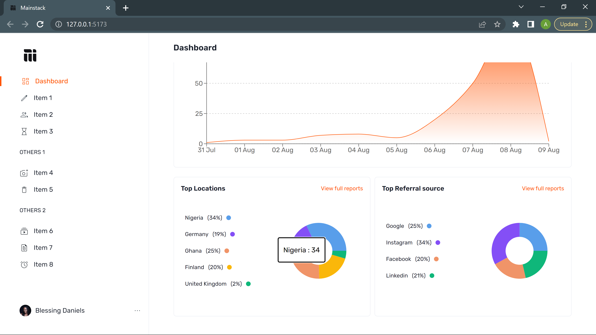
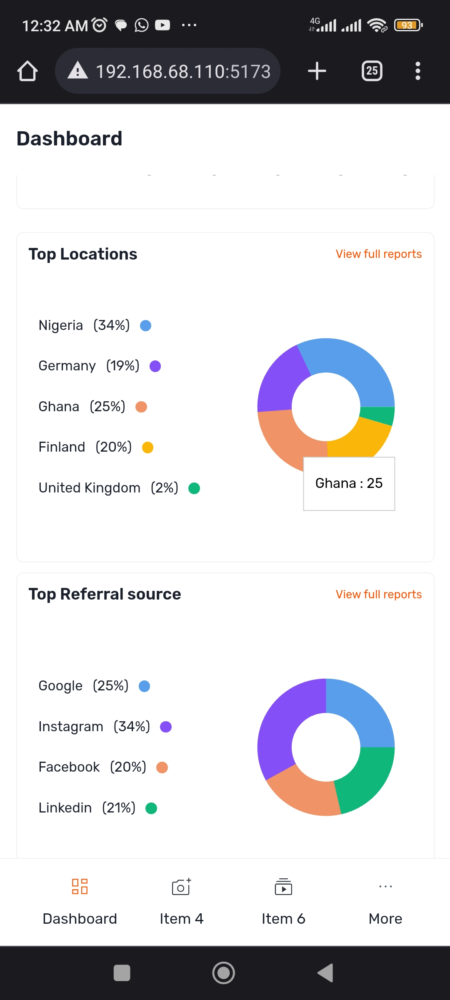

# Mainstack - Phase 1 interview

This is a solution to the Mainstack Phase 1 Interview for Frontend Engineer Position. 

## Table of contents

- [Overview](#overview)
  - [The challenge](#the-challenge)
  - [Screenshot](#screenshot)
  - [Links](#links)
- [My process](#my-process)
  - [Built with](#built-with)
- [Author](#author)

## Overview

### The challenge

- Implement the [figma design](https://www.figma.com/file/Cm5WhMEaHz81IKReYJbpI9/Mainstack-dev?node-id=0-1&t=vvcpWBXpU7QoxzJq-0)
- Use data from [provided endpoint](https://fe-task-api.mainstack.io/)

### Screenshot

###

###

### Links

- Live Site URL: (https://mainstack-assessment-beta.vercel.app/)

## My process

### Built with

- TypeScript
- [React](https://reactjs.org/)
- [Chakra UI](https://chakra-ui.com/)
- [Vite](https://vitejs.dev/)
- [Recharts](https://recharts.org/en-US)
- [SWR](https://swr.vercel.app/)

## Author

- Twitter - [@andemosa](https://www.twitter.com/andemosa)